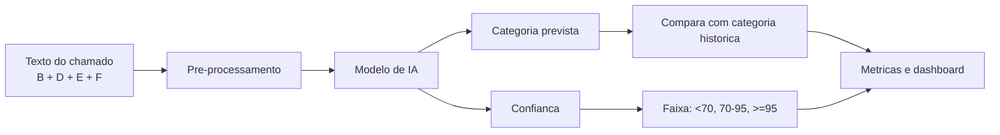
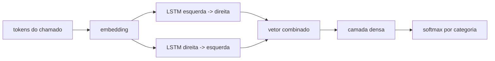

# Documentacao dos modelos e das estatisticas

Atualizado em 05/06/2026. Este documento explica, em linguagem tecnica mas operacional, como os modelos do experimento funcionam, como interpretar as metricas e quais criterios estatisticos serao usados antes de qualquer validacao humana.

## 1. Base usada pelos modelos

Cada chamado e transformado em um texto unico a partir de quatro campos da aba `CHAMADOS_ESQUELETO_REDUZIDO`:

| Campo | Coluna | Uso |
|---|---:|---|
| Titulo GLPI | B | resumo curto do problema |
| Descricao GLPI | D | texto principal do chamado |
| Titulo O.S.M. | E | titulo operacional complementar |
| Descricao O.S.M. | F | descricao operacional complementar |

Exemplo como se fosse Google Sheets:

```text
=B2 & " " & D2 & " " & E2 & " " & F2
```

Esse texto combinado e a entrada dos modelos. A categoria historica em `C` e usada como rotulo de treino/comparacao. Enquanto `validados=0`, todas as metricas sao contra esse historico, nao contra verdade humana validada.

## 2. Pipeline geral



## 3. TF-IDF: como o texto vira numeros

Modelos classicos nao leem texto diretamente. Primeiro o texto vira uma tabela numerica por termo.

Exemplo simplificado:

| Chamado | ar condicionado | vazamento | eletrica |
|---|---:|---:|---:|
| 1 | 0.80 | 0.10 | 0.00 |
| 2 | 0.00 | 0.70 | 0.20 |
| 3 | 0.10 | 0.00 | 0.90 |

Como uma celula de planilha, a ideia e:

```text
TF_IDF(termo, chamado) = frequencia_do_termo_no_chamado * raridade_do_termo_na_base
```

Termos muito frequentes em muitos chamados pesam menos; termos mais caracteristicos pesam mais.

## 4. Naive Bayes

O Naive Bayes estima a probabilidade de uma categoria dado o conjunto de palavras.

Equacao:

```text
P(categoria | palavras) proporcional a P(categoria) * produto(P(palavra | categoria))
```

Em linguagem de planilha:

```text
=prob_categoria * prob_palavra1_na_categoria * prob_palavra2_na_categoria * ...
```

Uso: rapido, simples, bom como baseline. Limite: assume independencia entre palavras, o que raramente e totalmente verdadeiro.

## 5. Regressao Logistica

A regressao logistica soma pesos das palavras para cada categoria e transforma isso em probabilidade.

Equacao simplificada:

```text
score = peso_1*termo_1 + peso_2*termo_2 + ... + bias
probabilidade = 1 / (1 + exp(-score))
```

Como planilha:

```text
=1/(1+EXP(-(A2*B2 + A3*B3 + A4*B4 + bias)))
```

Uso: forte para texto com TF-IDF, interpretavel por pesos. No experimento, esta entre os modelos competitivos.

## 6. Linear SVC

O Linear SVC separa categorias por margens. Ele tenta achar uma fronteira que deixe exemplos de categorias diferentes o mais separados possivel.

Equacao:

```text
score_categoria = soma(peso_termo * valor_tfidf)
categoria = maior score
```

Como planilha:

```text
=SE(score_categoria_A > score_categoria_B; "Categoria A"; "Categoria B")
```

Uso: muito forte para classificacao de texto. No multimodelo atual, foi o melhor contra o historico: `80,26%` de concordancia acumulada.

## 7. SGD

O SGD e uma forma de treinar modelo linear em passos pequenos. Ele atualiza pesos aos poucos, olhando exemplos e corrigindo erros.

Ideia operacional:

```text
peso_novo = peso_antigo - taxa_aprendizado * erro
```

Como planilha conceitual:

```text
=peso_antigo - (taxa * erro)
```

Uso: bom para bases grandes e treino incremental. Resultado atual ficou proximo dos outros lineares.

## 8. Random Forest e Extra Trees

Sao conjuntos de arvores de decisao. Cada arvore vota em uma categoria.

Exemplo:

| Arvore | Voto |
|---|---|
| 1 | Manutencao eletrica |
| 2 | Manutencao eletrica |
| 3 | Climatizacao |

Resultado:

```text
categoria = voto majoritario
```

Como planilha:

```text
=MODA(voto_arvore_1:voto_arvore_200)
```

Extra Trees usa divisoes mais aleatorias, aumentando diversidade. Random Forest escolhe divisoes buscando melhor separacao.

## 9. LSTM bidirecional

O LSTM e uma rede neural recorrente. Ele le a sequencia de tokens e tenta capturar contexto.



Configuracao registrada:

| Perfil | Vocabulario | Sequencia | Embedding | Observacao |
|---|---:|---:|---:|---|
| padrao | 8.000 | 120 tokens | 128 | rapido, usado em Etapa 1 |
| robusto | 20.000 | 220 tokens | 192 | maior, mais lento |

Softmax:

```text
prob_categoria_i = exp(score_i) / soma(exp(score_de_todas_as_categorias))
```

Como planilha:

```text
=EXP(score_categoria)/SOMA(EXP(score_todas_as_categorias))
```

Leitura atual: apesar de ser mais sofisticado, o LSTM materializado ficou abaixo dos modelos lineares contra o historico. No multimodelo atual: `67,57%`, enquanto `linear_svc` chegou a `80,26%`.

## 10. Comparacao atual das 7 IAs

Resultado da materializacao out-of-fold, sem vazamento:

| Modelo | Registros | Pendentes | Concordancia vs historico |
|---|---:|---:|---:|
| linear_svc | 13.825 | 0 | 80,26% |
| extra_trees | 13.825 | 0 | 78,47% |
| sgd | 13.825 | 0 | 77,51% |
| random_forest | 13.825 | 0 | 76,80% |
| regressao_logistica | 13.825 | 0 | 76,59% |
| naive_bayes | 13.825 | 0 | 70,07% |
| lstm | 13.825 | 0 | 67,57% |

Critério: a melhor IA atual contra historico e `linear_svc`. Isso nao significa aprovacao final, porque a categoria historica pode conter erros.

## 11. Estatisticas: para que servem

As estatisticas entram para responder perguntas que graficos simples nao respondem.

| Pergunta | Teste/indicador |
|---|---|
| A confianca alta realmente acompanha acerto? | correlacao confianca x acerto |
| Os modelos sao significativamente diferentes? | Cochran Q, McNemar, Friedman |
| A evolucao por turno tem tendencia? | regressao linear, residuos, Durbin-Watson |
| As metricas por turno seguem normalidade? | Shapiro-Wilk |
| Qual incerteza da acuracia? | bootstrap IC 95% |
| As IAs concordam entre si? | Fleiss Kappa |
| A IA concorda com o historico? | Cohen Kappa |

## 12. Criterios estatisticos

### Correlacao confianca x acerto

Uso: verificar se a confianca do modelo e confiavel.

Leitura:

```text
r perto de 0: confianca nao explica acerto
r positivo alto: confianca alta tende a acertar mais
p < 0,05: relacao estatisticamente detectavel
```

### Shapiro-Wilk

Uso: testar se a distribuicao da concordancia por turno parece normal.

Criterio:

```text
p > 0,05: nao rejeita normalidade
p <= 0,05: distribuicao nao normal
```

Se nao for normal, preferir testes nao-parametricos.

### Residuos e Durbin-Watson

Uso: verificar se a evolucao por turno tem padroes suspeitos.

Durbin-Watson:

```text
perto de 2: residuos independentes
perto de 0: autocorrelacao positiva
perto de 4: autocorrelacao negativa
```

### Cochran Q

Uso: comparar varios classificadores nas mesmas linhas.

Criterio:

```text
p < 0,05: pelo menos uma IA difere das outras em acuracia
```

### McNemar

Uso: comparar dois modelos linha a linha.

Exemplo:

| | Modelo B acerta | Modelo B erra |
|---|---:|---:|
| Modelo A acerta | ambos acertam | so A acerta |
| Modelo A erra | so B acerta | ambos erram |

Criterio:

```text
p < 0,05: diferenca entre os dois modelos e significativa
```

### Friedman + Nemenyi

Uso: comparar rankings de modelos em varios recortes.

Criterio:

```text
Friedman p < 0,05: ha diferenca global entre modelos
diferenca de rank medio > CD: diferenca significativa no pos-teste Nemenyi
```

### Kappa

Uso: medir concordancia descontando acaso.

Leitura pratica:

| Kappa | Interpretacao |
|---:|---|
| <0,20 | fraca |
| 0,21-0,40 | baixa |
| 0,41-0,60 | moderada |
| 0,61-0,80 | substancial |
| >0,80 | quase perfeita |

## 13. Decisao antes da validacao humana

1. Nao iniciar validacao humana ainda.
2. Finalizar visualizacao estatistica no dashboard.
3. Usar multimodelo como fonte comparativa principal.
4. Tratar `linear_svc` como candidato mais forte atual.
5. Reclassificacao fica sem prioridade ate concluir a Etapa 1/multimodelo e estatistica.
6. So depois iniciar validacao humana para confirmar se o historico ou a IA esta correta.

## Atualizacao - calibracao preliminar da confianca (2026-06-06)

A concordancia global responde "qual modelo acerta mais contra o historico?". A calibracao
responde outra pergunta: "quando o modelo diz alta confianca, essa confianca corresponde ao
acerto empirico?".

Foram publicados dois JSONs no dashboard:

| Arquivo | Funcao | Limite |
|---|---|---|
| `calibracao_modelos.json` | mede ECE/Brier usando a confianca bruta de cada IA | diagnostico, nao ajusta a escala |
| `calibracao_ajustada_modelos.json` | ajusta `P(previsao correta | confianca_bruta)` por sigmoid/isotonica out-of-fold | ainda usa historico, nao validacao humana |

Exemplo operacional: o `linear_svc` era o melhor modelo por concordancia (`80,26%`), mas sua
confianca bruta era inutil para decisao direta (`ECE=0,7101`, faixa `>=95%` vazia). Com a
calibracao escalar preliminar, o ECE ajustado caiu para `0,0019` e a faixa ajustada `>=95%`
ficou com `5.125` chamados e `98,36%` de acerto contra o historico.

Como planilha, a ideia e:

```text
confianca_ajustada = FUNCAO_CALIBRADA(confianca_bruta)
```

Essa funcao e aprendida com exemplos out-of-fold: linhas com confianca bruta parecida sao
comparadas com o acerto observado (`IA = categoria_historica`). A versao definitiva deve trocar
esse alvo por `IA = categoria_validada` apos a validacao humana.
